## 線上體驗

- [開啟 Streamlit 線上 Demo](https://ai-taiwan-stock-analysis.streamlit.app)
- [查看 GitHub 原始碼](https://github.com/guan-a311669/AI-Taiwan-Stock-Analysis-System)

> 公開 Demo 提供約 40 檔股票的分析資料，完整本機版本保留更多歷史資料與功能。# AI 奇摩股價預測與戰略分析系統

## 專案簡介

本專案是一套以台股資料為基礎的整合式分析系統，從股價資料整理、多空指標計算、機器學習預測、股票篩選，到 Streamlit 戰略儀表板，建立完整的資料分析流程。

系統目前整合六個主要模組：

1. 資料取得與資料庫建立
2. 多空指標計算
3. 股價漲跌預測
4. 多空指標股票篩選
5. 戰略儀表板
6. 策略回測

> 本專案主要用於資料分析、機器學習與視覺化作品展示，不構成任何投資建議。

---

## 專案目標

- 將台股歷史資料整理至 SQLite 資料庫
- 計算均線、RSI、KD、MACD 等技術指標
- 建立隔日漲跌預測模型
- 整合多空訊號與預測機率進行股票篩選
- 建立互動式戰略儀表板
- 保存分析紀錄，方便日後回顧
- 透過策略回測檢視歷史表現

---

## 系統流程

```text
股價資料取得
    ↓
SQLite 資料庫
    ↓
多空指標計算
    ↓
股價預測模型
    ↓
股票篩選器
    ↓
戰略儀表板
    ↓
分析紀錄與策略回測
```

---

## 主要功能

### 1. 資料取得與資料庫建立

- 建立台股資料庫
- 匯入股票清單與歷史股價
- 支援批次更新資料

### 2. 多空指標計算

- 均線指標
- RSI
- KD
- MACD
- 成交量與價格動能
- 多空分數與訊號分類

### 3. 股價預測模型

- 使用歷史技術指標建立分類模型
- 預測隔日上漲機率
- 輸出模型報告與特徵重要性
- 保存歷史預測紀錄

目前第一版模型準確率約為 **52.53%**，僅略高於隨機猜測，因此適合作為分析流程展示與輔助觀察工具。

### 4. 股票篩選器

整合多空訊號與預測結果，將股票分類為：

- 強勢看多
- 保守觀察
- 風險偏高
- 一般觀察

### 5. 戰略儀表板

- 股票代碼與名稱搜尋
- 自訂時間 Range
- 一鍵完整分析
- K 線與均線
- 成交量
- RSI、KD、MACD
- 多空分數
- 預測上漲機率
- 策略摘要
- 分析結果自動存檔
- 歷史分析紀錄載入

### 6. 策略回測

- 產生交易紀錄
- 計算資產曲線
- 輸出回測摘要

---

## 系統畫面

### 系統首頁

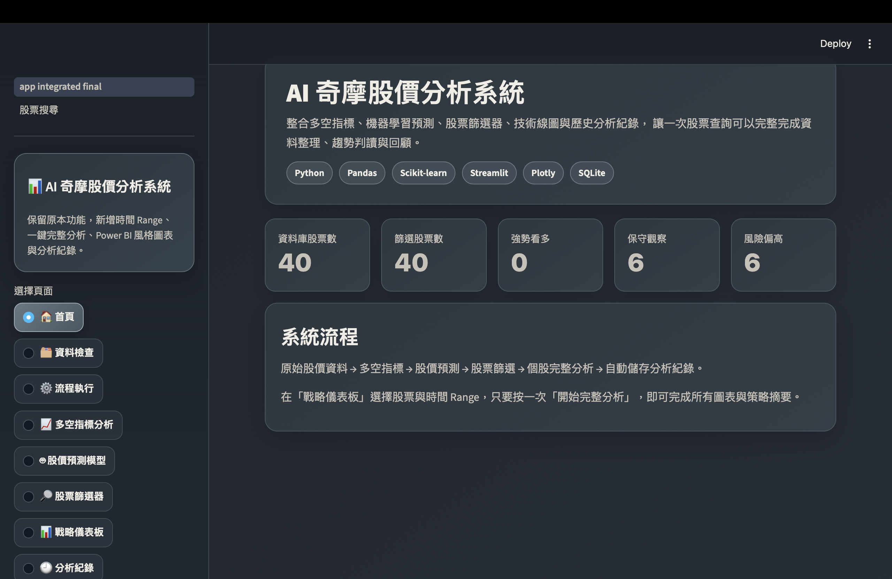

### 一鍵執行完整流程

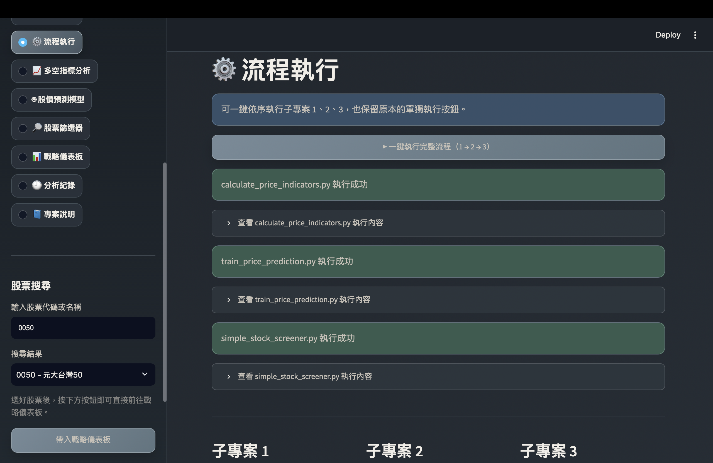

### 資料檢查

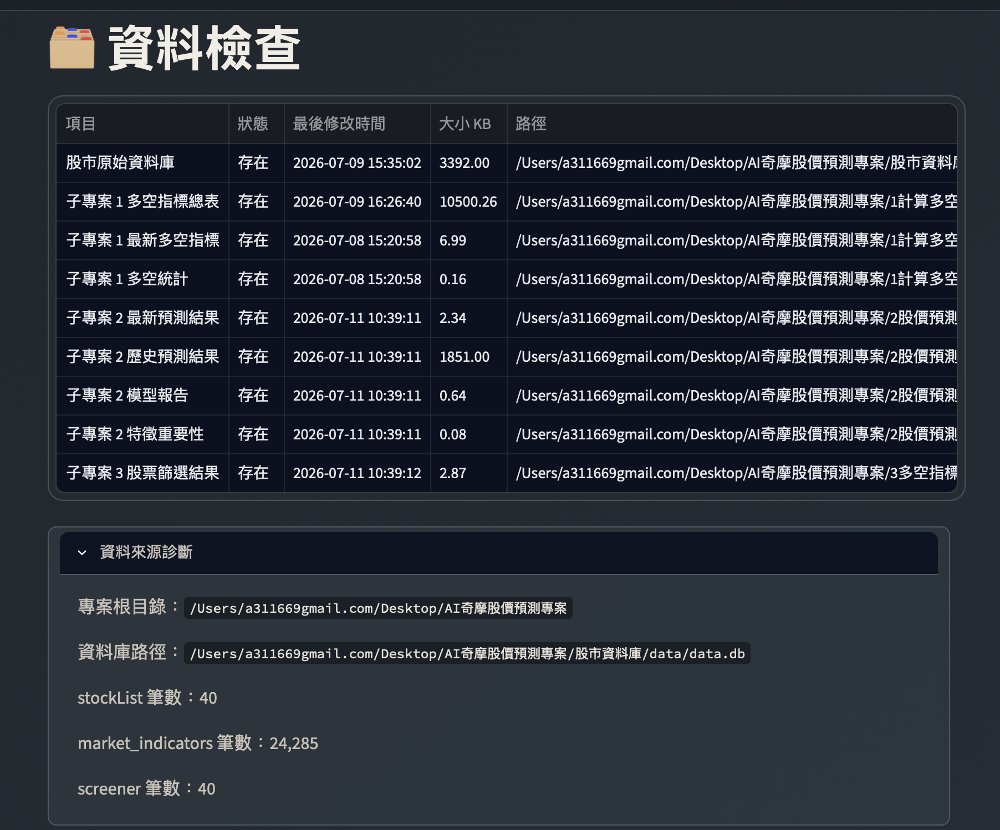

### 多空指標分析

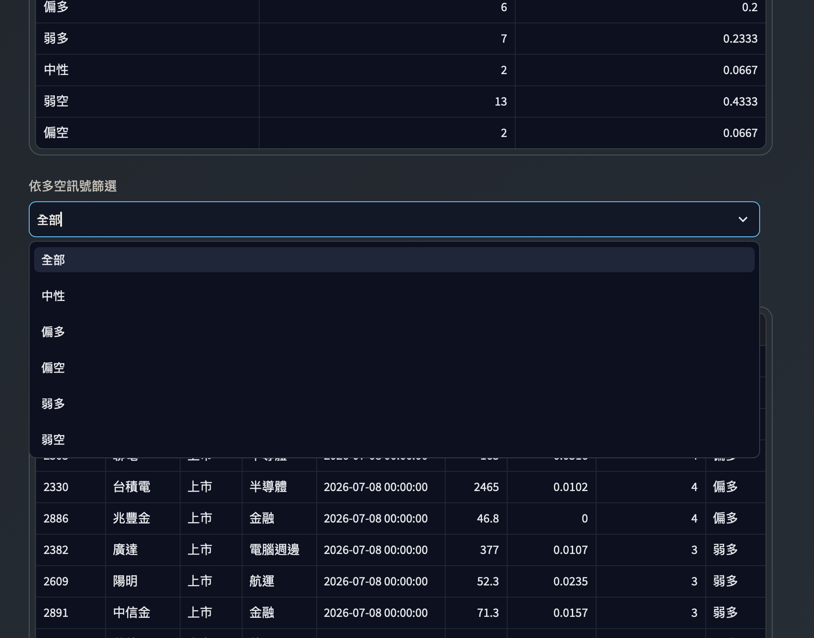

### 股價預測模型

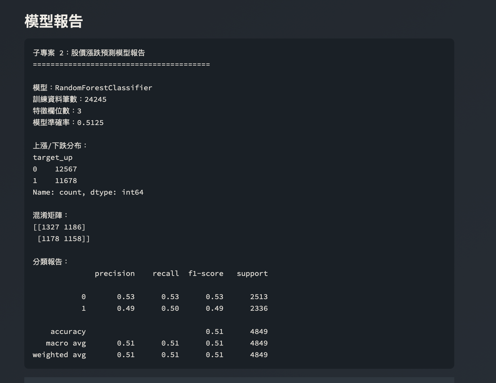

### 0050 戰略分析總覽

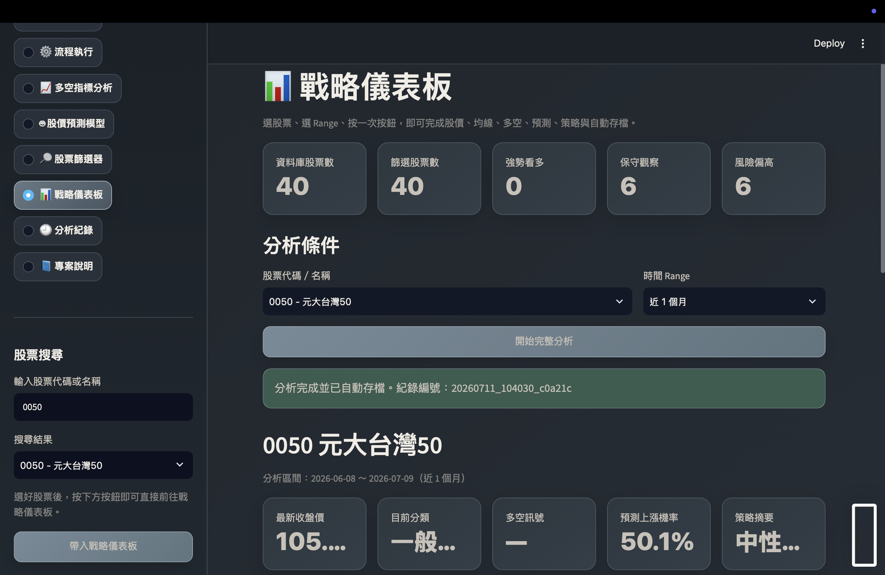

### 股價與均線

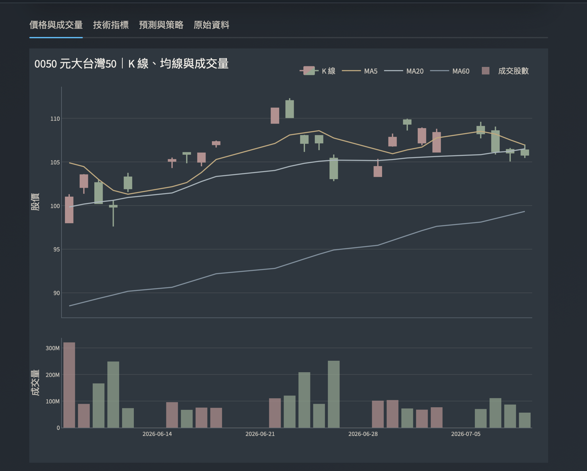

### RSI 與 KD

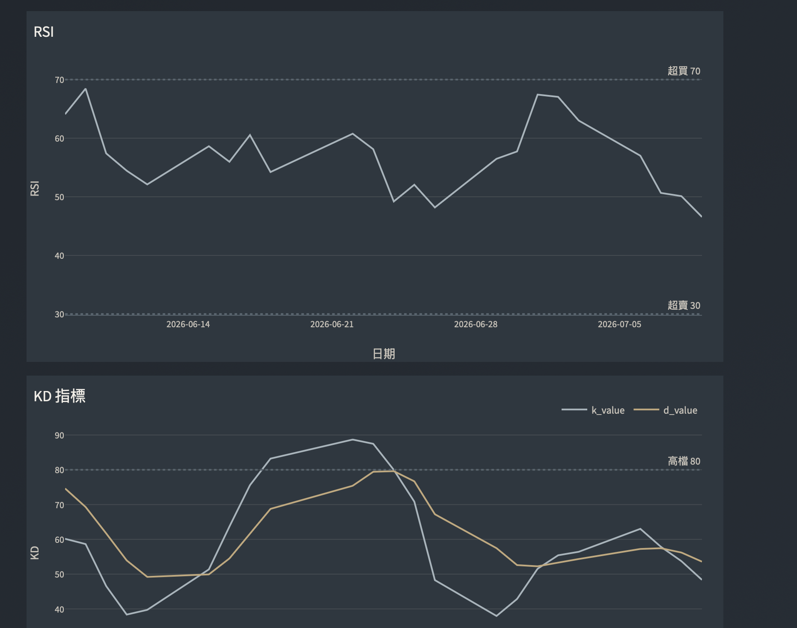

### MACD 與多空分數

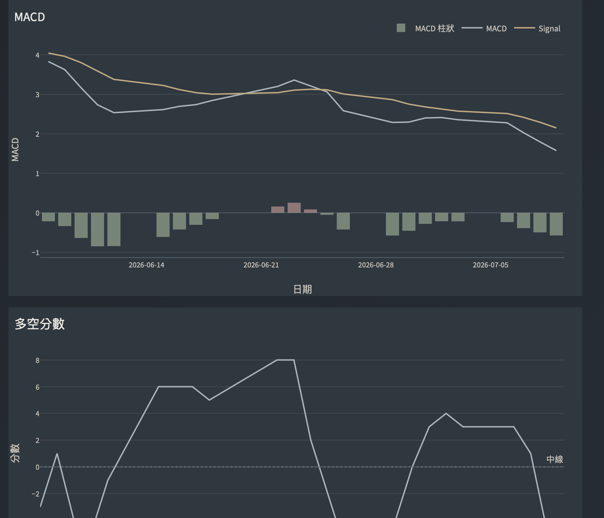

### 股票篩選器

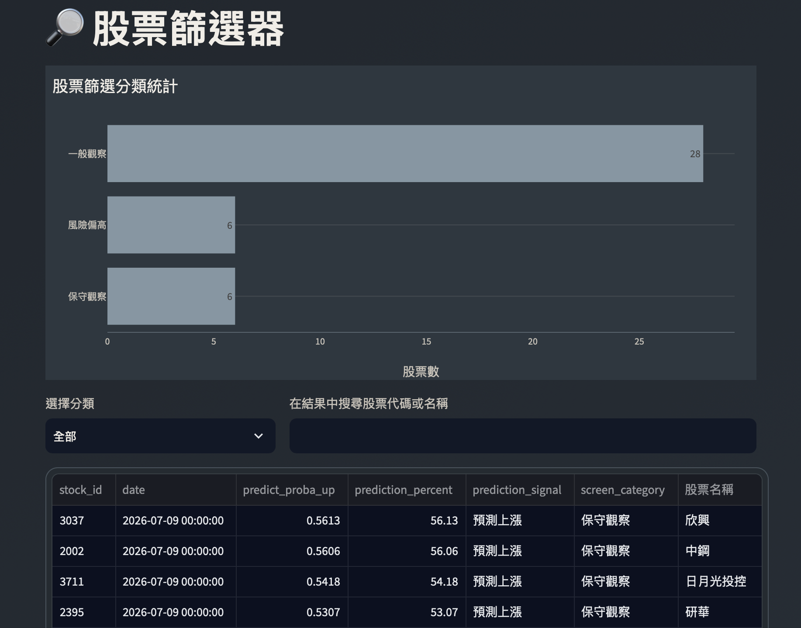

### 分析紀錄

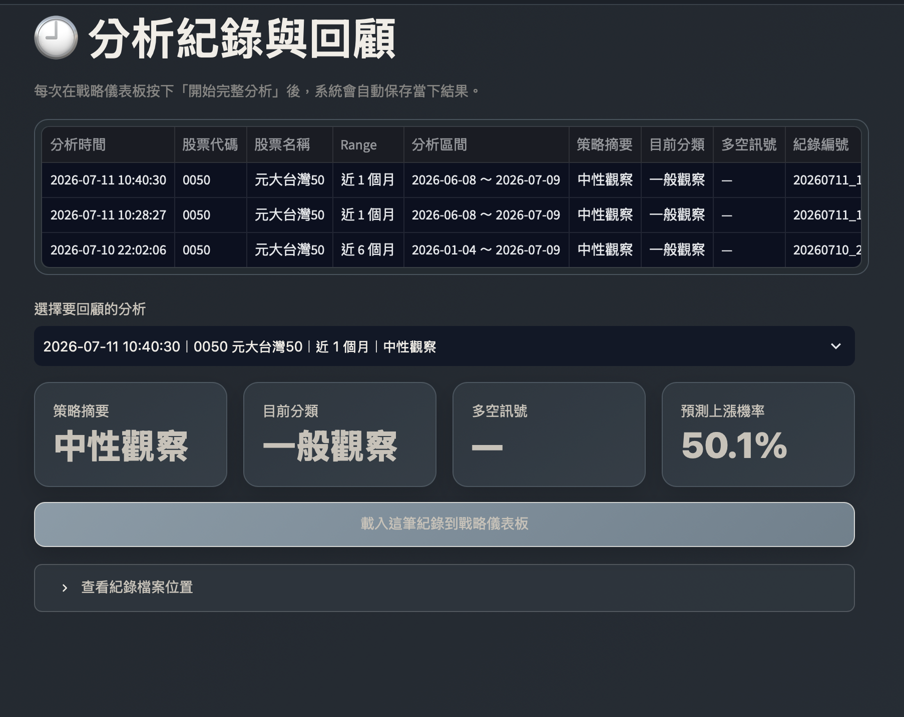

---

## 使用技術

- Python
- Pandas
- NumPy
- Scikit-learn
- Plotly
- Streamlit
- SQLite
- Matplotlib
- Git / GitHub

---

## 專案結構

```text
AI奇摩股價預測專案
├── 0資料取得與資料庫建立
├── 1計算多空指標
├── 2股價預測
├── 3多空指標股票篩選器
├── 4生成戰略儀表板
├── 5策略回測
├── 00專案文件
│   ├── 專案說明
│   ├── 成果截圖
│   ├── 簡報
│   └── Demo素材
├── daily_update.py
├── setup_scheduler.py
├── requirements_dashboard.txt
└── README.md
```

---

## 安裝與執行

### 1. 建立虛擬環境

```bash
python -m venv .venv
source .venv/bin/activate
```

### 2. 安裝套件

```bash
python -m pip install -r requirements_dashboard.txt
```

### 3. 啟動戰略儀表板

```bash
streamlit run "4生成戰略儀表板/app_integrated_final.py"
```

---

## 專案特色

- 從資料庫到模型與視覺化的一條龍流程
- 以一鍵執行完成三個核心子專案
- 支援股票搜尋與自訂分析期間
- 分析結果可自動保存與回顧
- 採用深色莫蘭迪配色，提升長時間閱讀舒適度
- 專案模組化，後續可擴充新聞情緒、法人籌碼與更多回測策略

---

## 專案限制

- 第一版模型準確率有限
- 股價容易受政策、消息與市場情緒影響
- 技術指標不等於未來報酬保證
- 回測結果不代表未來實際績效
- 系統目前主要作為學習與作品展示用途

---

## 未來優化方向

- 加入法人買賣超與籌碼面資料
- 加入新聞情緒分析
- 改用時間序列切分與滾動驗證
- 比較 XGBoost、LightGBM 等模型
- 增加更多策略回測與風險指標
- 部署線上 Demo
- 整合至 GHelper 個人作品平台

---

## 作者

張繕薇

資料分析、AI 應用與智慧醫療跨領域學習者。
